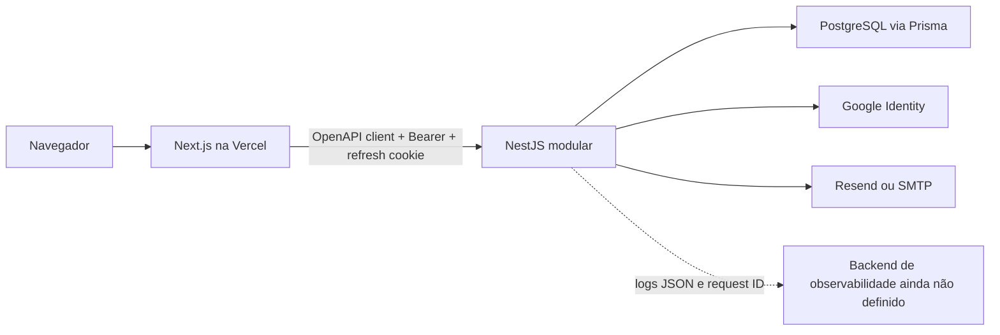

# Auditoria técnica de boas práticas do Sandicts

## 1. Resumo executivo

O Sandicts possui uma fundação técnica forte para um produto ainda em fase de
construção. A direção arquitetural está correta: monólito modular no backend,
frontend organizado por features, contrato OpenAPI gerado, configuração validada
no startup, autenticação com rotação de refresh token, testes automatizados e
promoção controlada entre ambientes.

A conclusão, porém, não é “pronto para produção”. O estado atual é adequado para
desenvolvimento e, depois de corrigir os bloqueadores imediatos, para Preview com
dados sintéticos. O uso com dados reais ainda deve aguardar o fechamento de
segurança operacional, testes integrados, observabilidade, continuidade e
privacidade.

Os principais bloqueadores encontrados são:

1. `npm audit` falha nos dois aplicativos com vulnerabilidades transitivas de
   severidade alta e correção disponível;
2. o backend não possui suíte E2E real nem testes de integração com PostgreSQL;
3. o E2E do frontend não está no CI e apresentou uma falha intermitente na
   execução completa;
4. headers de segurança estão incompletos no site publicado e não há Helmet no
   bootstrap da API;
5. o rate limiting da API não está preparado explicitamente para o proxy da
   hospedagem e ainda usa memória local;
6. logs estruturados existem, mas métricas, traces, alertas e SLOs ainda não;
7. não há política operacional versionada para backup/restore, RTO/RPO,
   incidentes e retenção de dados pessoais;
8. rotas rotuladas como protegidas e páginas de protótipo continuam acessíveis
   publicamente no domínio de produção, embora hoje não exponham dados reais.

### Avaliação por dimensão

| Dimensão | Estado | Leitura executiva |
| --- | --- | --- |
| Arquitetura de código | Forte | Limites e direção de dependências bem definidos; falta automatizar a proteção desses limites. |
| Qualidade e tipagem | Forte | Lint, TypeScript, formatação e build passam; backend usa modo estrito parcial. |
| Contrato API/frontend | Forte | OpenAPI versionado e cliente gerado com gate de drift. |
| Autenticação e sessão | Forte com ressalvas | Rotação, revogação, hash e cookies seguros; JWT próprio e proxy/rate limit exigem hardening. |
| Testes | Parcial | Boa cobertura unitária, mas baixa confiança em banco, rede e jornadas reais. |
| Segurança de supply chain | Insuficiente hoje | Audit bloqueante existe, mas está vermelho; faltam automação de atualização, SAST e pin imutável de Actions. |
| Observabilidade | Inicial | Logs e correlação estão bem desenhados; métricas, traces e alertas não foram implementados. |
| CI/CD | Boa base | Gates e promoção são sólidos; E2E, cobertura, segurança de imagem e paridade local/CI estão incompletos. |
| Documentação | Forte, manual | Fontes de verdade e ownership são claros; não há CI de links, frontmatter ou consistência. |
| Prontidão operacional | Inicial | Preview está sendo estruturado; produção de API, DR, SLO e política de dados ainda não estão fechados. |

### Recomendação de release

- Desenvolvimento local: **aprovado**.
- Preview com dados sintéticos: **condicional**, após os itens P0 e o hardening de
  proxy/headers.
- Produção com dados reais: **não aprovada nesta auditoria**.

Essa conclusão é coerente com a própria decisão do projeto em
`nodejs-sandicts-api/docs/ai/ci-cd/render-free-deployment.md`, que mantém produção
fora do escopo até banco, segredos, domínio, backup e promoção serem aprovados.

## 2. Escopo, snapshot e método

### Repositórios avaliados

| Repositório | Snapshot final da auditoria | Papel |
| --- | --- | --- |
| `sandicts/nodejs-sandicts-api` | `e9a3682`, branch `codex/KAN-27-api-preview-cicd` | API NestJS, autenticação, persistência, OpenAPI e deploy da API |
| `sandicts/reactjs-sandicts-web` | `54c2d77`, branch `developer` | Aplicação Next.js, design system, autenticação no navegador e cliente gerado |
| `sandicts/sandicts-docs` | `6064be0`, branch `docs/KAN-54-sync-open-match-jira`, antes deste relatório | Escopo, regras de negócio, glossário e decisões compartilhadas |

O commit da API mudou durante a auditoria porque a implementação do pipeline de
Preview foi concluída em outro trabalho no mesmo workspace. As conclusões de
CI/CD consideram o snapshot final acima. Nenhum código dos aplicativos foi
alterado por esta auditoria.

### Evidências coletadas

- inventário de arquivos, módulos, rotas, Prisma, configurações e workflows;
- inspeção de controllers, use cases, ports, adapters, cookies, tokens, CORS,
  rate limiting, logging, health checks e deploy;
- execução de lint, typecheck, testes, cobertura e builds;
- execução de `npm audit`, árvore das dependências afetadas e teste E2E;
- consulta HTTP aos domínios de produção e Preview em 2026-08-16;
- comparação com documentação oficial atual de NestJS, Next.js, Playwright,
  Vitest, GitHub, Docker, Prisma, PostgreSQL, Node.js, OWASP, OpenTelemetry,
  ANPD e práticas SRE.

### Limitações

- não foi realizado pentest, DAST, teste de carga ou chaos test;
- configurações privadas de GitHub, Vercel, Render, Neon e DNS não foram
  auditadas por dentro; apenas arquivos versionados e comportamento público;
- não foram usados dados reais nem credenciais;
- itens de domínio ainda não implementados foram avaliados como requisitos
  arquiteturais futuros, não como defeitos existentes.

## 3. Arquitetura observada



O backend adota um monólito modular pragmático. O fluxo predominante é:

```text
controller HTTP -> use case -> port -> adapter Prisma/provedor
```

Os módulos atuais são `auth` e `players`. Reservas, quadras, disponibilidade,
Organizations, Academies, pagamentos e partidas abertas estão documentados, mas
ainda não constituem capacidades implementadas equivalentes no backend.

O frontend usa App Router e mantém `src/app` relativamente fino, com composição
em `features`, componentes compartilhados, primitives de UI, i18n e cliente
OpenAPI gerado. Muitas rotas do produto ainda renderizam placeholders. Isso é
compatível com a fase atual, mas significa que a qualidade da fundação não deve
ser confundida com completude do MVP.

## 4. Boas práticas confirmadas

### 4.1 Backend e domínio

- Módulos são organizados por capacidade, e não por pastas globais de
  controllers/services/repositories.
- Use cases dependem de ports; Prisma e provedores externos permanecem nos
  adapters.
- Controllers são finos e contratos externos usam Zod, Swagger/OpenAPI e
  serialização de resposta.
- Erros esperados usam um catálogo semântico; erros inesperados são
  normalizados sem expor detalhes internos.
- Operações críticas de autenticação possuem atomicidade: refresh-token rotation
  usa atualização condicional e transação; magic-link replacement usa isolamento
  `Serializable` e retry de conflito. Isso está alinhado à orientação oficial da
  [Prisma sobre transações e conflitos concorrentes](https://www.prisma.io/docs/orm/prisma-client/queries/transactions).
- O banco possui UUIDs, unicidade, relações, cascatas/restrições e índices
  compatíveis com as consultas atuais.
- Health checks distinguem liveness e readiness; readiness consulta o banco.
- Configuração é validada no startup, incluindo HTTPS, CORS, segredos, cookies e
  provedores obrigatórios por ambiente.

### 4.2 Autenticação e segurança já presentes

- Access token curto; refresh token opaco, aleatório e armazenado somente como
  hash.
- Rotação de refresh token, detecção de reuso, revogação de família, idle timeout
  e absolute timeout.
- Cookie de refresh é `HttpOnly`, `Secure` nos ambientes seguros, tem `SameSite`
  explícito e path restrito.
- Magic links são aleatórios, persistidos como hash, expiram, são single-use e o
  anterior é revogado.
- CORS usa origins exatas e valida URLs de Preview em vez de um curinga amplo.
- Rate limits globais e limites mais restritos nas rotas de autenticação.
- Logs removem authorization, cookies, senhas, tokens, secrets e API keys.
- `.env` e `.env.local` estão ignorados; `.dockerignore` também exclui segredos e
  artefatos desnecessários.

O desenho de cookies está alinhado à orientação da
[OWASP para sessões, HttpOnly, Secure e SameSite](https://cheatsheetseries.owasp.org/cheatsheets/Session_Management_Cheat_Sheet.html).

### 4.3 Frontend

- `strict: true` no TypeScript, aliases claros e ESLint com Core Web Vitals,
  Testing Library, jest-dom e regras de Tailwind.
- Acesso ao backend centralizado; o access token permanece em memória e o
  refresh token fica no cookie HttpOnly.
- Refresh é single-flight e uma requisição com 401 é repetida no máximo uma vez.
- TanStack Query separa server state de estado visual.
- React Hook Form + Zod padronizam formulários e erros da API.
- i18n, metadata, Open Graph, sitemap, robots, skip link, navegação por landmarks
  e verificações de contraste já existem.
- O design system possui checks próprios contra resíduos, divergência de tokens
  e ícones antigos.

### 4.4 Contrato entre repositórios

- A API gera e versiona `openapi/sandicts-api.json`.
- O frontend gera o cliente com Orval.
- Os dois lados possuem gates contra drift do artefato gerado.
- Erros e responses são validados semanticamente, reduzindo a chance de o
  frontend depender de respostas informais.

Esse é um dos pontos mais maduros do projeto e deve ser preservado.

### 4.5 CI/CD, container e documentação

- O CI separa governança, qualidade, teste, contrato, build e audit.
- Branch, título, descrição, promoção e vínculo Jira possuem validação mecânica.
- Deploys usam ambientes do GitHub, permissões mínimas, concorrência controlada
  e SHA aprovado.
- Migrações são separadas do startup e a política expand-and-contract está
  documentada.
- O Dockerfile é multi-stage, usa imagem slim, `npm ci`, `npm prune --omit=dev`,
  runtime não-root e filesystem efêmero. Isso cobre várias recomendações da
  [documentação oficial de build do Docker](https://docs.docker.com/build/building/best-practices/).
- Produto, negócio, frontend e backend possuem ownership documental explícito,
  documentos canônicos e roteamento para evitar duplicação.
- Node 24 é uma escolha suportada e LTS; a linha recebe atualizações até abril
  de 2028 conforme a [documentação oficial do Node.js](https://nodejs.org/en/blog/migrations/v22-to-v24).

## 5. Resultado das validações reproduzíveis

| Verificação | Resultado |
| --- | --- |
| API lint | Passou |
| API typecheck | Passou |
| API build | Passou |
| API testes | 39 arquivos, 134 testes, todos passaram |
| API cobertura | 71,80% statements; 70,78% branches; 68,79% functions; 72,89% lines |
| Frontend quality | Visual system, lint, typecheck e Prettier passaram |
| Frontend unit/component | 36 arquivos, 148 testes, todos passaram |
| Frontend build | Passou; 18 páginas estáticas e 7 rotas dinâmicas geradas |
| Frontend E2E completo | 21 passaram e 1 falhou com 404 intermitente |
| E2E que falhou, isolado | Passou 3/3 repetições |
| API `npm audit` completo | Falhou: 2 vulnerabilidades altas (`js-yaml`, `nanoid`) |
| API `npm audit --omit=dev` | Falhou: 1 vulnerabilidade alta (`js-yaml`) |
| Web `npm audit` completo | Falhou: `js-yaml`, `nanoid` e `orval` afetado por `js-yaml` |
| Web `npm audit --omit=dev` | Falhou: 2 vulnerabilidades altas (`js-yaml`, `nanoid`) |

O E2E isolado passando não apaga a falha original. Pela classificação do
[Playwright](https://playwright.dev/docs/test-retries), um caso que falha e
passa depois é flaky e deve ser investigado, não simplesmente ignorado.

## 6. Achados priorizados

### P0-SEC-01 — Dependências vulneráveis bloqueiam os dois CIs

**Evidência**

- API: `js-yaml@4.3.0` chega ao production tree por `@nestjs/swagger`; o audit
  completo também encontra `nanoid@3.3.16` no toolchain Vitest/PostCSS.
- Frontend: `js-yaml@4.3.0` chega por `shadcn -> cosmiconfig` e por Orval;
  `nanoid@3.3.16` chega por `next -> postcss`.
- `shadcn` está em `dependencies`, embora não exista import runtime no código;
  seu uso observado é de CLI.
- O advisory de `js-yaml` afeta `<4.3.1` e tem patch em `4.3.1`:
  [GHSA-5p4m-2wfm-xmqj](https://github.com/advisories/GHSA-5p4m-2wfm-xmqj).
- O advisory de `nanoid` afeta `<3.3.18` e tem patch em `3.3.18`:
  [GHSA-2v37-7h3g-55p8](https://github.com/advisories/GHSA-2v37-7h3g-55p8).

**Risco**

Os advisories são de disponibilidade. A explorabilidade concreta parece baixa
nas rotas atuais, pois não foi encontrado YAML arbitrário vindo de usuários nem
uso de gerador Nano ID com tamanho controlado externamente. Mesmo assim, os
pacotes vulneráveis estão instalados, existem patches e o gate do projeto está
corretamente configurado para bloquear a entrega.

**Recomendação**

1. abrir remediações isoladas por repositório;
2. atualizar override/lockfile para `js-yaml >=4.3.1` e `nanoid >=3.3.18` sem
   reduzir o threshold do audit;
3. mover `shadcn` para `devDependencies` se a validação confirmar seu uso apenas
   como CLI;
4. executar clean install e toda a matriz documentada de cada repositório;
5. remover overrides e o patch de `node_modules` assim que a árvore upstream
   permitir.

**Aceite**: `npm audit --audit-level=moderate` e
`npm audit --omit=dev --audit-level=moderate` retornam zero nos dois aplicativos.

### P1-SEC-02 — Headers de segurança não estão completos

**Evidência**

- `next.config.ts` não define headers.
- O domínio `https://sandicts.com.br` respondeu com HSTS, mas sem CSP,
  `X-Content-Type-Options`, `Referrer-Policy`, `Permissions-Policy` ou proteção
  explícita de framing.
- O bootstrap NestJS não registra Helmet.

**Risco**

Reduz defesa em profundidade contra XSS, clickjacking, MIME sniffing e uso
indevido de recursos do navegador. A proteção da plataforma não substitui uma
política explícita da aplicação.

**Recomendação**

- adicionar uma CSP compatível com Next.js, Google Identity e fontes/assets do
  projeto, primeiro em `Report-Only`;
- definir `frame-ancestors`, `nosniff`, referrer e permissions policy;
- desabilitar `x-powered-by`;
- aplicar Helmet antes das rotas/middlewares da API e ajustar Swagger quando
  habilitado.

Referências: [headers no Next.js](https://nextjs.org/docs/app/api-reference/config/next-config-js/headers),
[CSP no Next.js](https://nextjs.org/docs/app/guides/content-security-policy) e
[Helmet no NestJS](https://docs.nestjs.com/security/helmet).

**Aceite**: teste automatizado e inspeção HTTP confirmam a política em Preview;
nenhum fluxo de login, OpenAPI ou assets é quebrado.

### P1-SEC-03 — Rate limiting não considera explicitamente proxy e escala

**Evidência**

- O `ThrottlerGuard` usa a implementação padrão.
- Não há configuração `trust proxy` nem `getTracker` próprio.
- A hospedagem planejada coloca a API atrás de proxy.
- O storage do throttler é local em memória.

**Risco**

O IP usado no limite e gravado na sessão pode ser o do proxy, agregando usuários
distintos no mesmo bucket, ou pode ser incorreto se a cadeia de proxies não for
validada. Em múltiplas instâncias, cada processo aplicaria um limite diferente.

**Recomendação**

- configurar apenas os proxies confiáveis e testar `req.ip`/`req.ips` no Render;
- criar tracker explícito e não confiar cegamente no primeiro
  `X-Forwarded-For`;
- antes de escalar horizontalmente, usar storage compartilhado ou rate limiting
  no edge;
- monitorar bloqueios por endpoint e evitar cardinalidade/PII desnecessária.

O próprio [guia do NestJS](https://docs.nestjs.com/security/rate-limiting)
exige configuração de proxy e explica que o storage padrão é em memória.

**Aceite**: testes com proxy confiável, header forjado e duas instâncias produzem
o tracker e o limite esperados.

### P1-TEST-01 — A pirâmide de testes não cobre banco e jornadas críticas

**Evidência**

- `npm run test:e2e` da API apenas imprime “E2E tests are not configured yet”.
- A maioria dos use cases usa repositórios in-memory nos testes.
- Não existem specs dos adapters Prisma atuais.
- O CI da API não sobe PostgreSQL para testes de integração.
- O frontend possui Playwright, mas o workflow de CI não instala browser nem
  executa `npm run test:e2e`.
- Uma execução completa do E2E falhou; o mesmo teste passou isoladamente 3/3.

**Risco**

As áreas mais sensíveis — concorrência, constraints, mapeamento Prisma,
migração, cookies, CORS, proxy e fluxo browser/API — podem quebrar enquanto os
testes unitários permanecem verdes.

**Recomendação**

1. criar testes de integração da API com PostgreSQL real e migrations;
2. priorizar refresh concorrente, consumo simultâneo de magic link, unicidade do
   perfil e readiness;
3. substituir o E2E-placeholder da API por suíte real ou por falha explícita;
4. executar Playwright no CI com um worker, browser instalado e artefatos em
   falha, como orienta o [guia oficial de CI do Playwright](https://playwright.dev/docs/ci);
5. investigar o 404 intermitente sob servidor dev paralelo e usar build/start no
   gate de release se isso representar melhor o deploy;
6. adicionar jornadas integradas para login, refresh, onboarding e autorização.

**Aceite**: CI reproduz banco e browser, as jornadas críticas passam de forma
estável e uma falha gera trace/screenshot acessível.

### P1-TEST-02 — Cobertura é medida somente na API e não possui baseline

**Evidência**

- A API mede cobertura, mas não configura thresholds nem roda cobertura no CI.
- O frontend não possui provider/script de cobertura.
- A cobertura de functions da API é 68,79%, menor que as demais dimensões.

**Risco**

Regressões podem reduzir silenciosamente a cobertura; uma porcentagem global
também pode esconder arquivos críticos sem nenhum teste.

**Recomendação**

- adotar o valor atual como baseline inicial, sem buscar 100% artificial;
- usar thresholds globais que só sobem e thresholds específicos para auth,
  autorização, regras de reserva e mapeadores;
- publicar resumo/artefato no CI;
- adicionar cobertura Vitest no frontend, com foco em hooks, auth runtime,
  erros, forms e componentes de estado.

O [Vitest suporta thresholds globais e por arquivo](https://vitest.dev/config/#coverage-thresholds).

**Aceite**: queda abaixo do baseline quebra o CI e os módulos críticos têm metas
mais altas que componentes puramente visuais.

### P1-AUTH-01 — JWT próprio aumenta o custo de segurança

**Evidência**

- `TokenService` implementa manualmente parsing, assinatura e validação HS256.
- Há allowlist fixa de algoritmo, comparação timing-safe, `exp` e verificação da
  sessão no banco, que são pontos positivos.
- Não existem claims/validação de `iss`, `aud`, `nbf` ou `jti`, nem estratégia de
  `kid`/rotação de chaves.

**Risco**

Não foi demonstrada vulnerabilidade no código atual, mas uma implementação
própria precisa acompanhar detalhes e novas recomendações do padrão. O custo
aumentará quando surgirem novos consumidores, rotação de chave ou mais tipos de
token.

**Recomendação**

- migrar para biblioteca JWT madura e mantida, com algoritmo fixado em
  configuração;
- introduzir issuer, audience, token ID e plano de rotação;
- manter a validação server-side de sessão/revogação;
- separar regras para access token e qualquer outro JWT futuro.

A [RFC 8725](https://datatracker.ietf.org/doc/rfc8725) e o
[guia REST da OWASP](https://cheatsheetseries.owasp.org/cheatsheets/REST_Security_Cheat_Sheet.html)
recomendam validar algoritmo, issuer, audience, expiração e regras específicas
por tipo de token.

**Aceite**: testes negativos cobrem algoritmo, issuer, audience, expiração,
not-before, rotação e confusão entre tipos de token.

### P1-FE-01 — Rotas protegidas e protótipos estão públicas

**Evidência**

- Existe catálogo `ROUTE_ACCESS_POLICIES`, mas ele não é aplicado como guarda de
  navegação.
- Não foi encontrado middleware/proxy de autorização no Next.js.
- Em 2026-08-16, `/app`, `/organizations/arena-sul`, `/prototypes/brand` e
  `/prototypes/player-profile-onboarding` responderam HTTP 200 em produção.
- As rotas operacionais atuais exibem placeholders e não retornam dados reais.

**Risco**

Hoje é principalmente exposição de UX e material interno. Quando dados forem
integrados, confiar apenas no shell do frontend pode provocar renderização
indevida, chamadas desnecessárias e percepção falsa de autorização. A API deve
continuar sendo a barreira definitiva.

**Recomendação**

- limitar protótipos a local/Preview ou protegê-los por feature flag não pública;
- implementar restauração de sessão e guarda server-side para rotas privadas;
- manter autorização por objeto e por contexto na API em toda operação;
- criar E2E de acesso anônimo, sessão expirada e usuário de outra Organization.

Authorization por objeto deve existir em cada endpoint que recebe um ID, como
orienta a [OWASP API1/BOLA](https://owasp.org/API-Security/editions/2023/en/0xa1-broken-object-level-authorization/).

**Aceite**: protótipos não existem em produção; acesso anônimo é redirecionado ou
negado; cross-Organization retorna `403` sem revelar existência ou dados.

### P1-OBS-01 — Há logging, mas ainda não há observabilidade operacional

**Evidência**

- Pino gera JSON, request/correlation IDs, duração, status, serviço, versão e
  trace context quando recebido.
- `OBSERVABILITY_ENABLED` só alimenta metadados do logger.
- Não há SDK/exporter de tracing, métricas de aplicação, dashboards, alertas ou
  SLO versionados.
- Não existe destino/retention policy documentado para logs.

**Risco**

Health checks dizem se o processo e o banco respondem, mas não explicam
degradação de login, email, latência, erros, saturação ou falhas de negócio.

**Recomendação**

- começar pelos sinais RED da API: request rate, error rate e duration;
- medir login, refresh, envio de magic link, readiness e pool do banco;
- instrumentar traces HTTP, Prisma e provedores externos com OpenTelemetry;
- correlacionar logs e traces e definir alertas baseados em impacto;
- instrumentar Core Web Vitals do frontend;
- evitar IDs de usuário/email como labels de métrica.

OpenTelemetry define [logs, métricas e traces como sinais complementares](https://opentelemetry.io/docs/concepts/signals/)
e alerta para o custo de labels de alta cardinalidade em
[métricas](https://opentelemetry.io/docs/concepts/signals/metrics/).

**Aceite**: dashboard de Preview mostra taxa, erro, p95/p99, dependências e
deploy/version; um erro sintético dispara alerta acionável com runbook.

### P1-OPS-01 — Continuidade e privacidade ainda não têm contrato operacional

**Evidência**

- Não foram encontrados RTO, RPO, teste de restore, runbook de incidente, matriz
  de criticidade ou política de retenção/exclusão.
- A API armazena email, display name, IP, user-agent e sessões; logs também podem
  registrar IP e user-agent.
- O documento de deploy reconhece que produção, backup e dados reais estão fora
  do escopo atual.

**Risco**

Sem objetivos e teste de recuperação, backup é apenas uma suposição. Sem
inventário/finalidade/retenção, dados pessoais podem permanecer além do
necessário ou ser enviados a logs/provedores sem governança clara.

**Recomendação**

- classificar dados e finalidades, base legal, retenção, exclusão e acesso;
- definir responsável por incidentes e comunicação;
- definir RTO/RPO realistas para MVP e testar restore;
- documentar backup do Neon, exportação, rotação de segredos e rollback de
  aplicação/migração;
- manter dados sintéticos em Preview;
- avaliar RIPD quando o tratamento puder gerar alto risco.

A [ANPD](https://www.gov.br/anpd/pt-br/centrais-de-conteudo/materiais-educativos-e-publicacoes/guia-vf.pdf)
trata autenticação, autorização e auditoria como componentes de controle de
acesso e recomenda gerenciamento de vulnerabilidades e segurança em nuvem. RTO
e RPO devem nascer dos requisitos de negócio, conforme o
[guia de disaster recovery](https://docs.cloud.google.com/architecture/disaster-recovery).

**Aceite**: restore é executado e cronometrado em ambiente isolado; runbook,
owners, RTO/RPO e política de dados são aprovados antes de dados reais.

### P2-SC-01 — Supply chain pode ser endurecida

**Evidência**

- GitHub Actions são referenciadas por tags como `actions/checkout@v4`, não por
  SHA completo.
- Não existe `.github/dependabot.yml` nos aplicativos.
- Não foi encontrado CodeQL/SAST, secret scanning versionado, SBOM, scan da
  imagem ou assinatura/attestation.
- O Dockerfile usa `node:24-bookworm-slim`, uma tag mutável.
- Os dois repositórios executam um `postinstall` temporário que altera código de
  `minimatch` dentro de `node_modules`; o workaround está documentado e falha de
  forma explícita, mas continua sendo dívida sensível.

**Recomendação**

- pin de Actions por SHA completo, mantido por Dependabot;
- Dependabot semanal para npm, GitHub Actions e Docker;
- habilitar CodeQL default setup para TypeScript;
- gerar SBOM e escanear a imagem construída;
- decidir entre digest de base image + atualização automatizada ou rebuild
  periódico controlado;
- eliminar o patch de `node_modules` quando os dependentes suportarem a versão
  corrigida nativamente.

O GitHub afirma que [pin por SHA completo é a referência imutável](https://docs.github.com/en/actions/reference/security/secure-use)
e documenta [Dependabot para npm, Actions e Docker](https://docs.github.com/en/code-security/how-tos/secure-your-supply-chain/secure-your-dependencies/configure-version-updates).
O [CodeQL suporta JavaScript/TypeScript](https://docs.github.com/en/code-security/concepts/code-scanning/codeql/codeql-code-scanning).

**Aceite**: PRs automáticas mantêm referências atualizadas; SAST e scan de
imagem bloqueiam severidades acordadas; SBOM fica associada ao artefato.

### P2-REL-01 — Integrações externas não têm política explícita de resiliência

**Evidência**

- Google verification, Resend e SMTP não configuram timeout explícito no nível
  do adapter.
- Não há política comum de retry/backoff, circuit breaker ou idempotency key.
- O envio de magic link ocorre sincronicamente após persistir o challenge.

**Risco**

Uma dependência lenta pode prender workers e elevar latência. Retry ingênuo pode
duplicar email; ausência de retry pode degradar UX em falhas transitórias.

**Recomendação**

- definir timeout curto por integração;
- retry somente para falhas transitórias e operações seguras/idempotentes, com
  jitter e limite;
- instrumentar latência/erro por provedor;
- avaliar outbox/queue quando volume ou confiabilidade justificar;
- revogar ou marcar challenge cuja entrega falhou, preservando resposta
  privacy-safe.

**Aceite**: testes simulam timeout, 429, 5xx e resposta lenta sem duplicar email
nem bloquear indefinidamente uma requisição.

### P2-ARCH-01 — Limites arquiteturais dependem de disciplina manual

**Evidência**

- Os imports atuais respeitam majoritariamente a direção documentada.
- Não há regra automatizada que impeça domain/application de importar Prisma,
  controllers ou adapters indevidos.
- Autenticação é repetida nos controllers por leitura manual do Bearer token;
  isso ainda é pequeno, mas crescerá com os módulos.

**Recomendação**

- adicionar testes de arquitetura ou lint de boundaries;
- definir API pública mínima por módulo;
- introduzir guard/principal autenticado compartilhado quando as rotas
  protegidas crescerem, mantendo autorização de negócio no use case/policy;
- criar teste negativo para cada boundary importante.

**Aceite**: um import proibido de Prisma no application/domain falha no CI e os
módulos consumidores usam somente contratos públicos.

### P2-CODE-01 — Há hotspots e strictness desigual

**Evidência**

- O frontend tem `strict: true`; o backend ativa apenas parte da família strict.
- `no-floating-promises` e `no-unsafe-argument` são warnings no backend, e o CI
  não usa `--max-warnings=0`.
- `player-profile-onboarding-prototype.tsx` tem 707 linhas; seu catálogo tem 305
  e `sport-catalog-search.tsx`, 281.
- `env.schema.ts` da API tem 386 linhas e mistura catálogo, parsing e regras
  cruzadas de vários domínios de configuração.

**Recomendação**

- migrar o backend para `strict: true` e avaliar `noUncheckedIndexedAccess` e
  `exactOptionalPropertyTypes` com adoção incremental;
- tornar warnings relevantes bloqueantes;
- dividir o onboarding por etapas/view models/componentes e preservar os testes;
- separar schemas de env por domínio e manter um único refinamento de regras
  cruzadas.

O [TypeScript](https://www.typescriptlang.org/tsconfig/strict) define `strict`
como o conjunto de verificações que oferece garantias mais fortes de correção.

**Aceite**: strict mode completo passa; CI falha com promise flutuante; nenhum
componente de produção concentra múltiplas etapas e responsabilidades.

### P2-DOC-01 — Documentação forte, porém sem verificação automática

**Evidência**

- O repositório compartilhado tem 26 Markdown e aproximadamente 6.277 linhas.
- Não há workflow de CI; apenas template de PR.
- A especificação funcional possui cerca de 1.696 linhas e o workflow Jira,
  984, aumentando custo de revisão.
- Há pequena deriva: o checklist ainda exemplifica níveis como amador e
  profissional, enquanto spec, API e frontend usam `beginner`, `intermediate` e
  `advanced`.

**Recomendação**

- validar links relativos e cross-repo, frontmatter, arquivos canônicos e
  Markdown no CI;
- adicionar teste de vocabulário para enums compartilhados de alto impacto;
- dividir documentos grandes por capability sem duplicar fontes de verdade;
- separar claramente decisão aberta, aprovada e implementada.

**Aceite**: link quebrado, canonical duplicado ou enum divergente falha no CI;
cada documento grande tem índice e ownership claro.

### P2-DATA-01 — Invariantes futuras precisam chegar ao banco

**Evidência**

- A documentação exige impedir dupla reserva do mesmo espaço/horário e acesso
  cross-Organization.
- Esses módulos ainda não existem no schema atual.

**Risco futuro**

Somente um `SELECT` seguido de `INSERT` em aplicação não impede corrida entre
requisições concorrentes. UUID não substitui autorização por objeto.

**Recomendação**

- modelar intervalos com constraints no PostgreSQL, transação adequada e
  tratamento do conflito como regra de negócio;
- considerar exclusion constraint GiST para sobreposição de horários por
  quadra;
- carregar Organization/Academy scope a partir da sessão/membership, não de um
  ID confiado do cliente;
- testar duas reservas simultâneas e acesso entre tenants.

O PostgreSQL documenta que uma
[exclusion constraint sobre range impede intervalos sobrepostos](https://www.postgresql.org/docs/17/rangetypes.html#RANGETYPES-CONSTRAINT).

**Aceite**: teste concorrente permite exatamente uma confirmação para o mesmo
intervalo e testes BOLA bloqueiam leitura/escrita entre tenants.

### P3-DEV-01 — Toolchain local e CI não estão totalmente alinhados

**Evidência**

- API usa `.nvmrc` genérico `24`; frontend fixa `24.16.0`.
- A máquina auditada executou Node `24.14.0` e npm `11.9.0`.
- Frontend declara `packageManager: npm@11.13.0`; API declara `npm@11.9.0`.
- Os checks passaram, mas não necessariamente com as versões exatas do CI.

**Recomendação**

- adotar uma versão patch comum de Node 24 e npm 11 nos dois repositórios;
- fazer CI validar a versão exata ou documentar intencionalmente que apenas o
  major é contrato;
- automatizar atualização coordenada do toolchain.

**Aceite**: instalação nova, máquina local e CI reportam as mesmas versões
contratadas.

## 7. Roadmap recomendado

### Etapa 0 — Desbloquear a linha de entrega

1. Remediar `js-yaml` e `nanoid` nos dois repositórios.
2. Reexecutar clean install, audit e matrizes completas.
3. Confirmar que o pipeline recém-adicionado da API parte de um commit verde.

### Etapa 1 — Tornar Preview confiável

1. Configurar proxy/tracker de rate limit.
2. Aplicar headers/Helmet e validar Google Identity/Swagger.
3. Colocar Playwright no CI e estabilizar o 404 intermitente.
4. Criar integração PostgreSQL para auth e migrations.
5. Ocultar protótipos fora de local/Preview.
6. Instrumentar métricas mínimas, logs exportados e alerta de readiness/5xx.

### Etapa 2 — Preparar o primeiro vertical real

1. Aplicar guarda de rotas e autorização por contexto.
2. Fixar baseline de cobertura e teste de arquitetura.
3. Definir constraints concorrentes para disponibilidade/reserva.
4. Implementar o vertical completo, incluindo estados de erro e E2E browser/API.
5. Medir Core Web Vitals e latência da API.

### Etapa 3 — Gate de produção com dados reais

1. Aprovar classificação/retenção de dados e responsabilidades LGPD.
2. Definir e testar backup/restore, RTO/RPO e incident response.
3. Endurecer supply chain, imagem e gestão de chaves.
4. Revisar JWT, rotação de segredos e timeouts de provedores.
5. Executar threat model e pentest do fluxo entregue.
6. Aprovar SLOs, alertas e capacidade mínima paga quando necessário.

## 8. Definition of Done recomendada

Uma capability do Sandicts só deve ser considerada concluída quando:

- regra de negócio e decisão aberta estiverem reconciliadas;
- migration possuir constraint para invariantes que exigem atomicidade;
- controller, schema, use case, port e adapter respeitarem os limites;
- autorização por objeto/contexto estiver testada;
- OpenAPI e cliente gerado estiverem sem drift;
- testes unitários, integração PostgreSQL e E2E relevante passarem;
- logs, métricas e erros forem privacy-safe e acionáveis;
- feature tiver loading, empty, forbidden, not-found e failure states;
- CI, audit, coverage baseline e build/container estiverem verdes;
- rollout, rollback e mudança de schema forem compatíveis;
- documentação canônica e Jira refletirem o comportamento realmente entregue.

## 9. Referências principais

- [NestJS: Helmet](https://docs.nestjs.com/security/helmet)
- [NestJS: rate limiting, proxies e storage](https://docs.nestjs.com/security/rate-limiting)
- [Next.js: production checklist](https://nextjs.org/docs/app/guides/production-checklist)
- [Next.js: Content Security Policy](https://nextjs.org/docs/app/guides/content-security-policy)
- [Playwright: Continuous Integration](https://playwright.dev/docs/ci)
- [Vitest: coverage thresholds](https://vitest.dev/config/#coverage-thresholds)
- [Prisma: transactions and isolation](https://www.prisma.io/docs/orm/prisma-client/queries/transactions)
- [PostgreSQL: range exclusion constraints](https://www.postgresql.org/docs/17/rangetypes.html#RANGETYPES-CONSTRAINT)
- [GitHub Actions: secure use](https://docs.github.com/en/actions/reference/security/secure-use)
- [GitHub: Dependabot version updates](https://docs.github.com/en/code-security/how-tos/secure-your-supply-chain/secure-your-dependencies/configure-version-updates)
- [GitHub: CodeQL](https://docs.github.com/en/code-security/concepts/code-scanning/codeql/codeql-code-scanning)
- [Docker build best practices](https://docs.docker.com/build/building/best-practices/)
- [OWASP ASVS](https://devguide.owasp.org/en/06-verification/01-guides/03-asvs/)
- [OWASP Session Management](https://cheatsheetseries.owasp.org/cheatsheets/Session_Management_Cheat_Sheet.html)
- [OWASP API Security — BOLA](https://owasp.org/API-Security/editions/2023/en/0xa1-broken-object-level-authorization/)
- [RFC 8725 — JWT Best Current Practices](https://datatracker.ietf.org/doc/rfc8725)
- [OpenTelemetry signals](https://opentelemetry.io/docs/concepts/signals/)
- [ANPD: Segurança da Informação para agentes de pequeno porte](https://www.gov.br/anpd/pt-br/centrais-de-conteudo/materiais-educativos-e-publicacoes/guia-vf.pdf)
- [Google Cloud: disaster recovery, RTO e RPO](https://docs.cloud.google.com/architecture/disaster-recovery)
